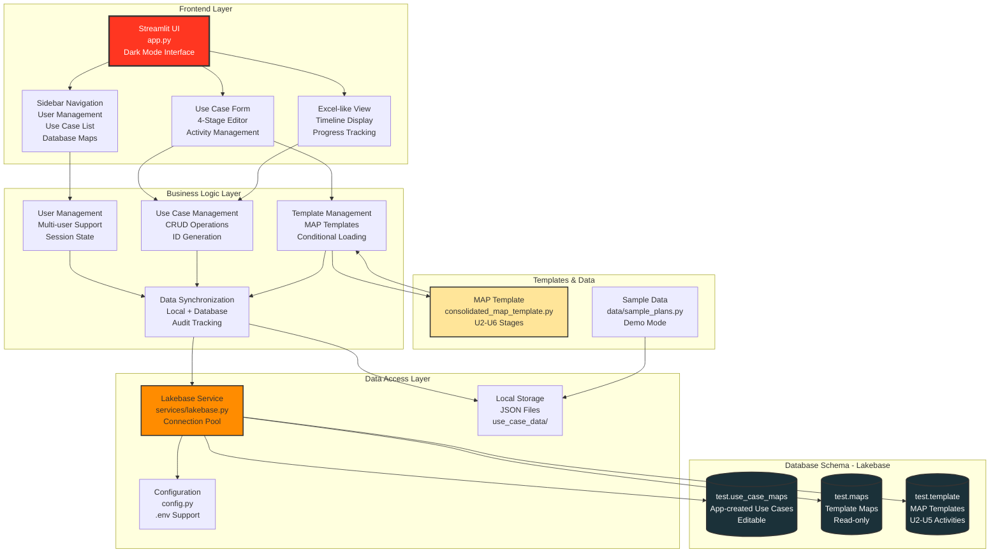

# Use Case Maps - Architecture Diagram

## Component Details

### Frontend Layer (Streamlit)
- **UI (app.py)**: Main application entry point, dark mode Databricks-branded interface
- **Sidebar**: User selection, use case list, database maps browser
- **Form**: 4-stage use case creation wizard with activity editor
- **View**: Excel-like implementation plan display

### Business Logic Layer
- **User Management**: Multi-user support with isolated workspaces
- **Use Case Management**: Create, read, update, delete operations with readable ID generation
- **Template Management**: Load MAP templates with SSA/POC conditional logic
- **Data Synchronization**: Dual persistence (local + database) with audit tracking

### Data Access Layer
- **Lakebase Service**: PostgreSQL driver abstraction (psycopg2/pg8000/psycopg2cffi)
- **Local Storage**: JSON-based fallback for demo mode
- **Configuration**: Environment-based database connection management

### Database Schema
- **test.use_case_maps**: Stores app-created use cases (editable)
  - use_case_id, use_case_name, customer_name
  - Stage, Outcome, Embedded_Questions, Owner_Name
  - created_by, created_at, updated_by, updated_at
- **test.maps**: Template maps for reference (read-only)
- **test.template**: MAP template activities (U2-U5)

## Data Flow

### Creating a New Use Case
1. User selects "New Use Case" from sidebar
2. Form loads MAP template from database or consolidated_map_template.py
3. Conditional activities filtered based on SSA/POC requirements
4. SA/AE names auto-populated in owner fields
5. User edits activities and timeline
6. On save:
   - Generate readable use case ID (CUSTOMER-YYYY-MM-SEQ)
   - Save to local JSON file
   - Write to test.use_case_maps table with audit fields
   - Update session state and refresh UI

### Loading Existing Maps
1. Sidebar queries both test.maps and test.use_case_maps
2. Displays categorized lists:
   - "Your Use Cases" (editable, from use_case_maps)
   - "Template Maps" (read-only, from maps)
3. User clicks "Use" to create new use case from template
4. Activities loaded and populated with current user's SA/AE names

## Technology Stack
- **Frontend**: Streamlit 1.x
- **Database**: PostgreSQL/Databricks Lakebase
- **Languages**: Python 3.8+
- **Data Processing**: pandas, openpyxl
- **Drivers**: psycopg2, pg8000, psycopg2cffi

